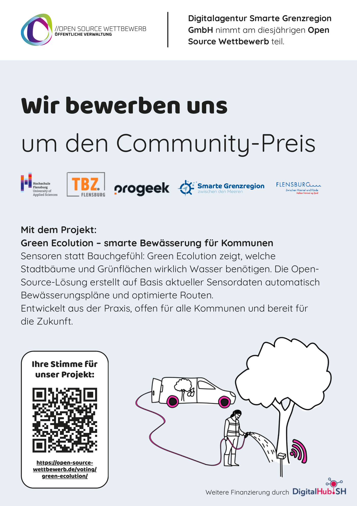

Der Open Source Wettbewerb richtet sich an öffentliche Verwaltungen auf Bundes-, Landes- und kommunaler Ebene und zeichnet Digitalisierungsprojekte aus, die auf Open Source setzen. Green Ecolution ist dieses Jahr dabei, eingereicht hat die Bewerbung die Digitalagentur Smarte Grenzregion GmbH. Neben den Jury-Kategorien gibt es den Community-Preis, über den die Öffentlichkeit entscheidet, und genau um den bewerben wir uns.

## Womit wir antreten

Der Kern der Bewerbung passt in drei Worte: Sensoren statt Bauchgefühl. Green Ecolution zeigt, welche Stadtbäume und Grünflächen wirklich Wasser benötigen, und erstellt auf Basis aktueller Sensordaten automatisch Bewässerungspläne und optimierte Routen. Die Lösung ist Open Source, entwickelt aus der Praxis und offen für alle Kommunen. Wer diesem Blog folgt, kennt einen Teil dieser Praxis schon aus der Nähe. Die [Testsensoren](/blog/acht-von-zehn-sensoren) liegen bereits im Flensburger Stadtgebiet im Boden.

Auf der Bewerbung stehen alle Partner, die das Projekt tragen: die Hochschule Flensburg, das Technische Betriebszentrum Flensburg, PROGEEK, die Smarte Grenzregion und die Stadt Flensburg.

## Abstimmen bis zum 30. September

Das Community-Voting läuft vom 17. August bis zum 30. September 2026. Deine Stimme kannst du in diesem Zeitraum direkt auf der Seite des Wettbewerbs abgeben, unter [open-source-wettbewerb.de/voting/green-ecolution](https://open-source-wettbewerb.de/voting/green-ecolution/). Verliehen werden die Preise Mitte Oktober auf der Smart Country Convention.

Jede Stimme hilft, dem Projekt und dem Thema datenbasierte Bewässerung mehr Sichtbarkeit zu geben.
