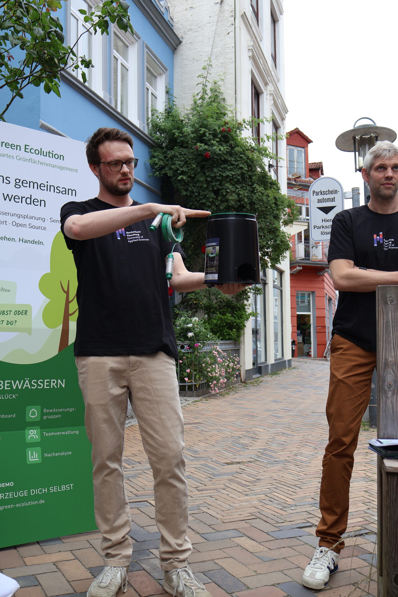
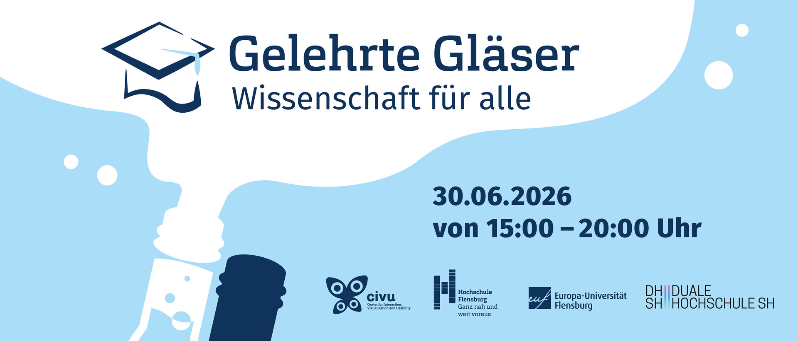

„Wissenschaft für alle“ ist das Motto der Gelehrten Gläser. Statt in den Hörsaal einzuladen, kommen Forschende dorthin, wo man ohnehin gern sitzt, in die Cafés und Bars der Flensburger Innenstadt. Wer mag, hört bei einem Getränk zu und kommt danach direkt ins Gespräch. Hinter dem Format stehen das CIVU, die Europa-Universität Flensburg, die Hochschule Flensburg und die Duale Hochschule Schleswig-Holstein. Am 30. Juni 2026 verteilten sich die Vorträge zwischen 15:00 und 20:00 Uhr über die Innenstadt, jeweils zwei pro Ort.

## Smarte Bewässerung im Lille Lykke

Green Ecolution war um 16:30 Uhr im Lille Lykke in der Norderstraße zu Gast. Vorgestellt habe ich das Projekt gemeinsam mit Prof. Dr. Simon Olberding, mit dem Green Ecolution im Master-Forschungsprojekt entstanden ist. Unter dem Titel „Green Ecolution: Smarte Bewässerung von städtischen Grünflächen“ haben wir gezeigt, worum es geht: Bodenfeuchtesensoren erfassen, was unter der Oberfläche passiert, und aus den Messwerten entstehen Bewässerungspläne und Routen für die Praxis. Die [Testsensoren](/blog/acht-von-zehn-sensoren) dafür liegen bereits im Flensburger Stadtboden.

## Ein paar Straßen weiter

Die Bäume, um die es in dem Vortrag ging, stehen nur ein paar Straßen weiter. Nach dem Vortrag blieb Zeit, direkt am Tisch weiterzureden, ohne Mikrofon und ohne Podium. Genau dafür lohnt sich das Format.

Danach sind wir selbst weitergezogen. An den anderen Orten liefen Vorträge aus Fächern, mit denen wir im Projektalltag nie zu tun haben, und die haben sich mindestens so gelohnt wie unser eigener Beitrag. An einem Abend und auf wenigen hundert Metern hört man, woran die Flensburger Hochschulen sonst noch arbeiten.

Formate wie die Gelehrten Gläser schaffen diese Nähe, dafür ein herzlicher Dank an die Organisatorinnen und Organisatoren.

