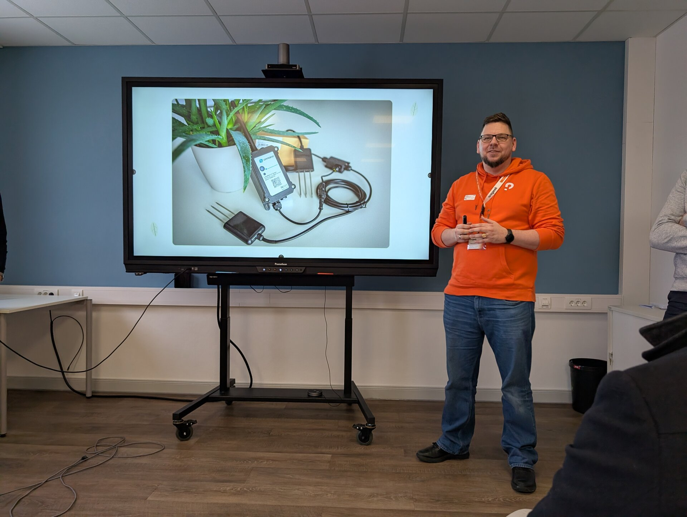
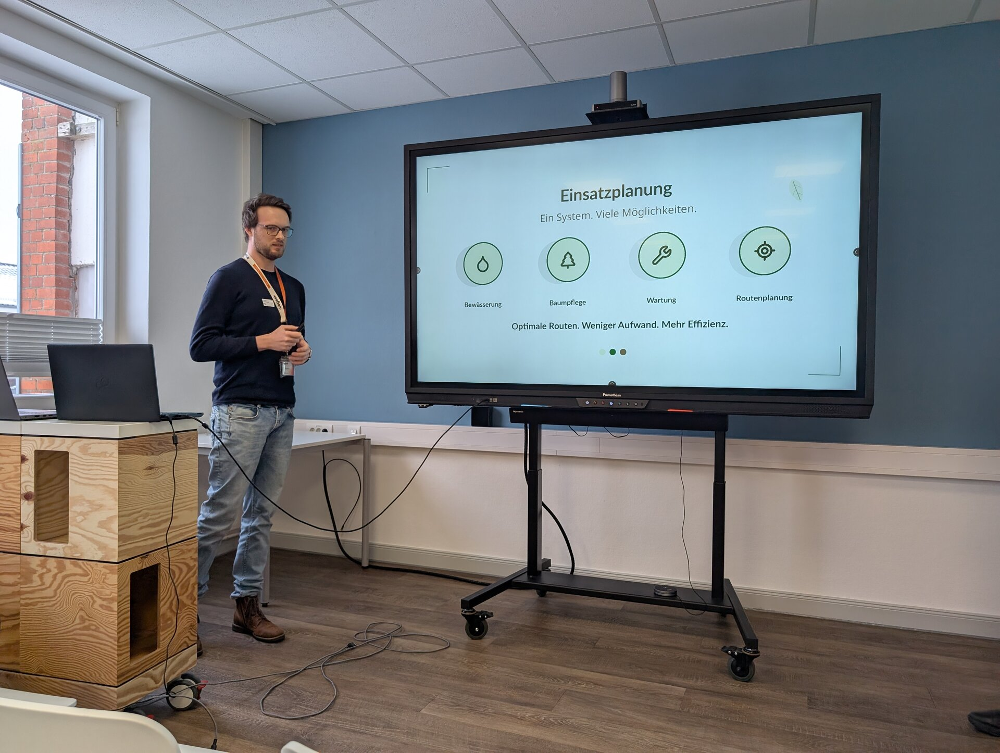

„Offen denken – offen handeln – offen vernetzen": Unter diesem Motto hat das Smart City Amt Süderbrarup am 4. Februar 2026 zum Smart Region Day eingeladen. Zwischen 14:00 und 17:30 Uhr ging es darum, wie Open Source, offene Lernformate und offene Kooperationen die Digitalisierung im ländlichen Raum voranbringen, mit Impulsen aus Politik, Wirtschaft und Kommunen, Projektvorstellungen und Raum zum Vernetzen. Für Green Ecolution ist das ein Heimspiel: Die Plattform ist Open Source, entsteht in enger Zusammenarbeit mit einer Kommune und ist so gebaut, dass weitere sie übernehmen können.

## Was wir gezeigt haben

Wir waren mit einer Projektvorstellung dabei und haben Green Ecolution einmal von vorn bis hinten erzählt. Den Anfang macht die Hardware: Bodenfeuchtesensoren, die ihre Messwerte energieeffizient über LoRaWAN funken. Darauf aufbauend kommt die Anwendung, die aus den Daten ablesbar macht, welche Bäume und Grünflächen tatsächlich Wasser brauchen.

Den Abschluss bildete die Einsatzplanung, das Stück der Plattform, das aus Messwerten konkrete Arbeit macht: Bewässerung, Baumpflege, Wartung und Routenplanung in einem System, mit optimierten Routen für weniger Aufwand im Betriebsalltag.

## Offen vernetzen, wörtlich genommen

Der Rest des Nachmittags gehörte dem, wofür das Format gemacht ist: dem Austausch mit Kommunen, Unternehmen und Initiativen, die die digitale Transformation im ländlichen Raum mitgestalten wollen. Genau in diesem Umfeld soll Green Ecolution wirken, und deshalb war Süderbrarup für uns der richtige Ort, um das Projekt vorzustellen. Danke an das Smart City Amt Süderbrarup für die Einladung und die Organisation.
