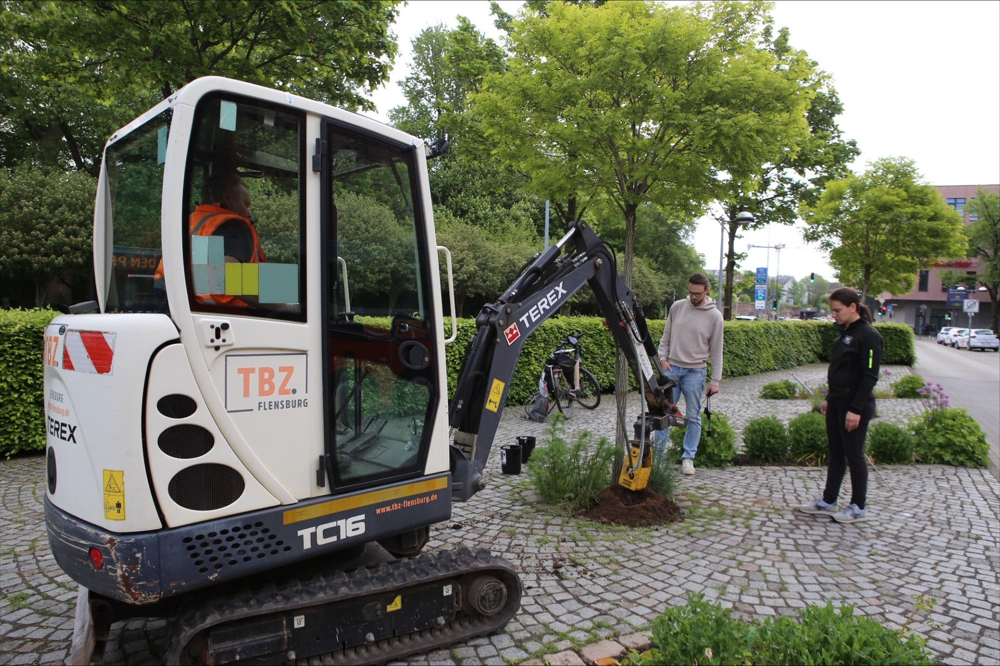

Green Ecolution wants to plan the irrigation of urban trees based on measured data instead of gut feeling. That takes sensors in the ground, and the first of them are now in place: on 21 May 2026, together with the Technisches Betriebszentrum Flensburg (TBZ), the city's technical operations center, we installed the first three soil moisture sensors at urban trees in Flensburg. It is the first of several trial installations in which we test the hardware and the workflow under real conditions.

## What the sensors measure

The sensors record soil moisture, temperature and soil water tension at two depths (40 and 80 cm). This paints a picture of how much water is actually available to a tree, not just directly below the surface but also in the deeper layers from which the roots draw their water. On this basis, the platform will eventually show when irrigation is necessary, so that watering runs go exactly where they are needed.

## The installation

Drilling and burying went smoothly. Each site took about 10 to 15 minutes: the TBZ drills the hole with an earth auger, we place the sensor, connect it and fill the hole back in. Still, there was one lesson for the next installations: a flashlight now belongs on the packing list.

## First data over LoRaWAN

The sensors send their readings over LoRaWAN, a radio network that gets by on very little energy and covers long distances. That keeps maintenance low and makes it easy to add further sites. One of the open questions before the installation, however, was whether the connection would also hold up reliably from within the soil.

The first readings give an encouraging answer: the concept works. Even below the soil surface the sensors transmit reliably, provided the site has good LoRaWAN coverage. How the sensors behave under poor coverage is something we do not know yet.

## What comes next

Next, we will take a closer look at the incoming data and learn to interpret it: how do the values react to rain, and what happens in dry spells? In the following trial installations we also want to test the assignment between sensor and tree in the web application, which is still under development. In the long run that is exactly where the readings will go: into a platform that makes the irrigation demand visible on a map and derives optimized watering routes from it.
