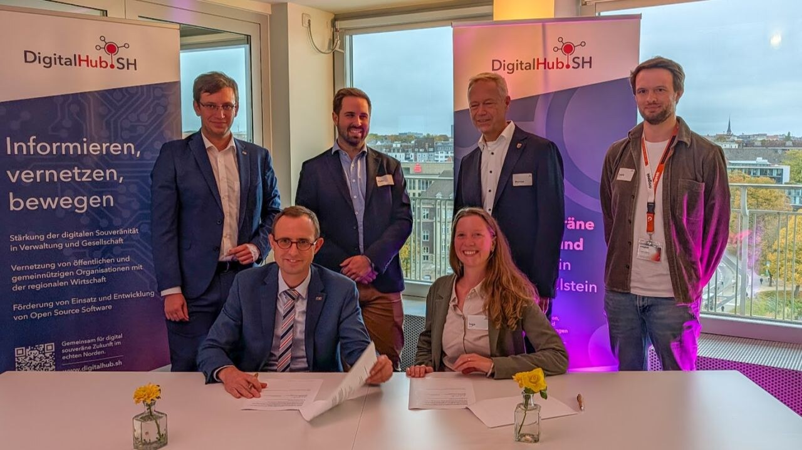

Green Ecolution gets a tailwind from the state: the project is one of 17 that Schleswig-Holstein finances through the Offene Innovation ("open innovation") state program. On 14 October 2025 all project teams met at the Innopier in Kiel to sign the contracts, in the presence of Dirk Schrödter, the state's minister for digitalization and head of the state chancellery. For Green Ecolution this means six-figure funding; in total the state provides close to three million euros for the 17 projects.

## Selected from 61 ideas

Behind the commitment lies a selection process. The call for concepts by DigitalHub.SH drew 61 submissions from all over Schleswig-Holstein this year, about a third more than the year before. An expert jury assessed the concepts by criteria including practical relevance, scalability and reusability. Those three describe the core of Green Ecolution rather well: the platform is built for practical use in Flensburg, as open source, and in a way that other municipalities can adopt it.

## The day at the Innopier

In Kiel the teams first presented their projects on stage; for Green Ecolution with a look at the starting point and the vision. Then came the signatures: for Green Ecolution, minister for digitalization Dirk Schrödter, Alexander Rosenthal (DigitalHub.SH), Malte Zinke (Digitalagentur), Inga Marken and Dr. Marcus Ott (both City of Flensburg) as well as Cedrik Hoffmann (PROGEEK).

Flensburg was represented twice that day: alongside Green Ecolution, DimA also received a commitment, a digital multilingual anamnesis for general practices. With these projects, the city shows how municipal innovation, open source and digital sovereignty go hand in hand, as minister Schrödter put it.

## From the university into municipal routine

Green Ecolution originated as a research project of master's students at the Flensburg University of Applied Sciences. With the funding it becomes a tool for everyday municipal work: the City of Flensburg carries the project, PROGEEK handles the implementation. The goal is an open source platform for sensor-based, data-driven green space management that makes visible which trees and green spaces actually need water, making their care more efficient and sustainable. The work on it starts now.
