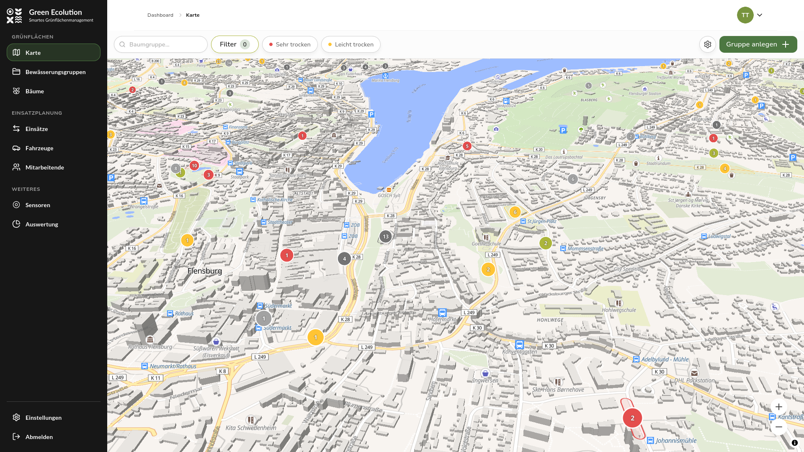
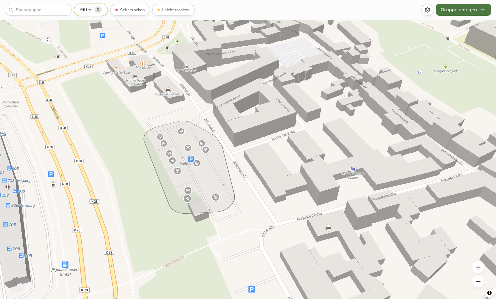
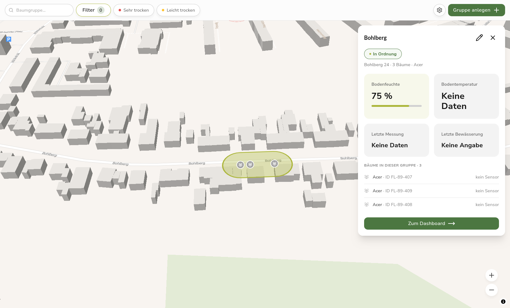
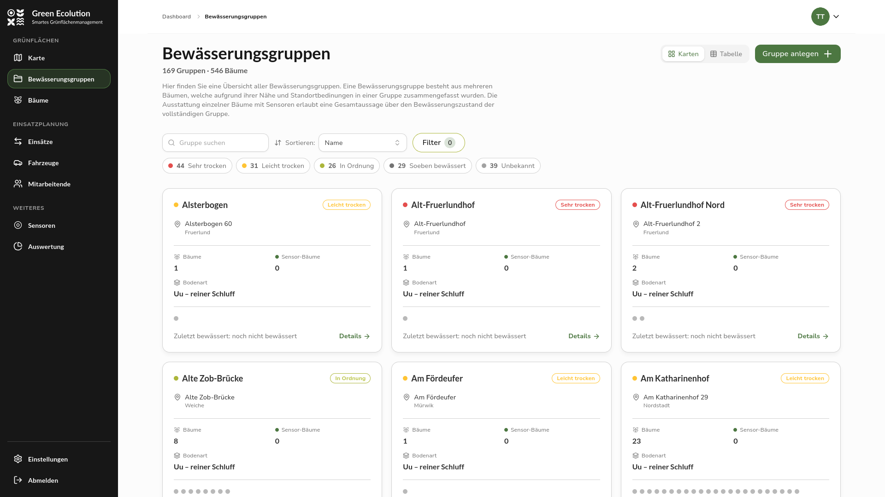
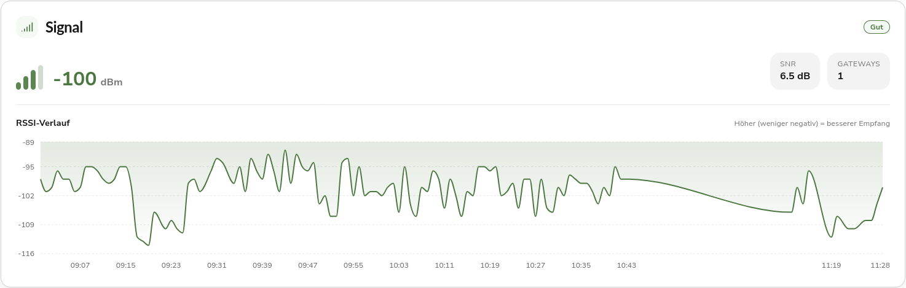

Nach dem Release [0.2.1](/releases/v0.2.1), der vor allem Fehler rund um Anmeldung, Listen und Sensoren behoben hat, steht in Version 0.3.0 wieder ein größerer Ausbau im Vordergrund. Der Schwerpunkt liegt darauf, wie Bewässerungsgruppen auf der Karte und in der Übersicht dargestellt und bearbeitet werden. Hinzu kommen ein fachlich genauerer Bewässerungsstatus und mehrere Erleichterungen bei der Arbeit mit Sensoren.

## Highlight des Releases

### Neue interaktive Karte

Die interaktive Karte wurde vollständig neu aufgebaut. Grundlage ist jetzt MapLibre GL mit einer vektorbasierten Grundkarte, was das Zoomen und Verschieben flüssiger macht und die zuvor aufgetretenen Stabilitätsprobleme adressiert. Auch das Anlegen von Bäumen direkt auf der Karte funktioniert wieder zuverlässig.

Bewässerungsgruppen erscheinen zunächst als Marker. Wird näher herangezoomt, teilt sich ein Marker in die einzelnen Bäume der Gruppe auf. Damit dabei erkennbar bleibt, welche Bäume zusammengehören, zeichnet die Karte nun eine Umrandung um die Bäume einer Gruppe.

Das Anlegen, Bearbeiten und Auswählen läuft jetzt in Panels direkt auf der Karte ab, ohne Wechsel auf eine andere Seite. Ein Klick auf eine Bewässerungsgruppe öffnet nicht mehr sofort das Dashboard, sondern ein Detailpanel als Schnellvorschau. Es zeigt die wichtigsten Kennzahlen der Gruppe, darunter Bodenfeuchte, Bodentemperatur, die letzte Messung und die letzte Bewässerung, sowie die Bäume der Gruppe. Auf dem Desktop erscheint das Panel an der rechten Seite, auf dem Smartphone am unteren Bildschirmrand. Der Weg zum vollständigen Dashboard bleibt über eine eigene Schaltfläche erhalten.

## Neue Übersicht der Bewässerungsgruppen

Die Übersicht aller Bewässerungsgruppen war bisher eine lange Liste. Sie ist nun ein Karten-Raster, in dem jede Gruppe als eigene Karte dargestellt wird. Eine Karte zeigt den Namen, den Bewässerungsstatus, Bezirk und Adresse, die Anzahl der Bäume und der Sensor-Bäume sowie den Zeitpunkt der letzten Bewässerung.

Über dem Raster stehen eine Suche, Filter nach Bezirk und Vegetationsform, eine Sortierung sowie eine Statusübersicht, die auf einen Blick zeigt, wie viele Gruppen kritisch, moderat oder optimal versorgt sind. Wer lieber die gewohnte Tabelle nutzt, kann jederzeit zwischen Karten- und Tabellenansicht umschalten. Der Status in dieser Übersicht aktualisiert sich jetzt von selbst, ohne dass die Seite neu geladen werden muss.

## Verbesserungen bei den Sensoren

Ein vorbereiteter Sensor lässt sich ab dieser Version auch ohne QR-Code in Betrieb nehmen. Direkt auf der Sensor-Detailseite kann er aktiviert und einem Baum zugeordnet werden, was besonders dann hilft, wenn keine Kamera zur Hand ist oder der Code nicht lesbar ist. Ein aktiver Sensor kann auf einen anderen Baum umgemeldet werden, und die Zuordnung lässt sich wieder aufheben, wodurch der Sensor in den Zustand „Vorbereitet" zurückkehrt. Die Baumauswahl erfolgt über einen Dialog mit Suche und einer kleinen Karte.

Neben der Zuordnung erfasst die Anwendung nun auch die Empfangsstärke jedes Sensors. Aus den Funk-Metadaten des Netzwerks werden je Messung die technischen Kennwerte der Verbindung (RSSI und SNR) gespeichert und daraus eine Verbindungsqualität abgeleitet, die pro Sensor als Stufe von gut bis schlecht angezeigt wird. Auch der Verlauf über die Zeit ist einsehbar, sodass sich eine nachlassende Funkverbindung frühzeitig erkennen lässt.

## Optimierter Bewässerungsstatus

Der Bewässerungsstatus für die Bodenfeuchte-Sensoren wurde fachlich überarbeitet. Bisher beruhte die Ampel auf einem festen Schwellwert, der überall gleich galt. Das war ungenau, denn wie viel Wasser ein Boden speichern kann, hängt stark von der Bodenart ab, und junge Bäume mit flachen Wurzeln sollten nicht anhand der tiefen Sonde bewertet werden.

Der Status wird jetzt aus Bodenart, Sondentiefe und Baumalter abgeleitet. Bäume unter drei Jahren werden nur über die flache Sonde in 40 cm Tiefe beurteilt, ältere Bäume über beide Sonden, wobei der schlechtere Wert zählt. Damit gibt die Ampel den tatsächlichen Wasserbedarf deutlich genauer wieder.

## Weitere Verbesserungen und Betrieb

Die Seitenleiste wurde neu gestaltet und ist nun dauerhaft ausgeklappt, sodass die Navigation ohne zusätzliches Aufklappen erreichbar ist. Auf Tablet-Breite klappt sie platzsparend zur Icon-Leiste ein.

Im Hintergrund wurde die Protokollierung für den Betrieb vereinheitlicht. Die Logausgabe liegt jetzt in flachem JSON vor, die Request-ID steht als eigenes Feld zur Verfügung, und die Feldnamen sind über alle Komponenten hinweg einheitlich, was die Auswertung und Fehlersuche erleichtert. Ein Audit hat sichergestellt, dass keine personenbezogenen Daten oder Zugangsdaten wie Tokens, Passwörter oder E-Mail-Adressen in den Logs landen. Für einen zuverlässigeren Betrieb prüft ein neuer Readiness-Endpoint, ob die benötigten Dienste wie die Datenbank erreichbar sind, bevor die Anwendung Anfragen annimmt.

Für den Einsatz in Flensburg lassen sich die Bäume des städtischen Baumkatasters über ein eigenes Kommandozeilenwerkzeug importieren und aktualisieren.

## Behobene Fehler

Beim Speichern einer Bewässerungsgruppe wird deren räumliche Position jetzt korrekt in der Datenbank abgelegt, damit die Gruppe zuverlässig auf der Karte verortet wird. Die Panels zum Anlegen von Bäumen und Gruppen sind nun auch auf Mobilgeräten bedienbar, und das Detailpanel einer Gruppe wird über der Karte eingeblendet und nutzt dieselbe Dialog-Optik wie die übrigen Panels.

## Ausblick

Die optimierte Routenführung in den Bewässerungsplänen wird als Linie auf der Karte wieder sichtbar, sobald der Routing-Dienst reaktiviert ist. Auch die Sensorfunktionen und die Auswertung des laufenden Betriebs werden weiter ausgebaut.

Rückmeldungen und Fehlerberichte sind jederzeit willkommen auf [GitHub](https://github.com/green-ecolution/green-ecolution/issues).
