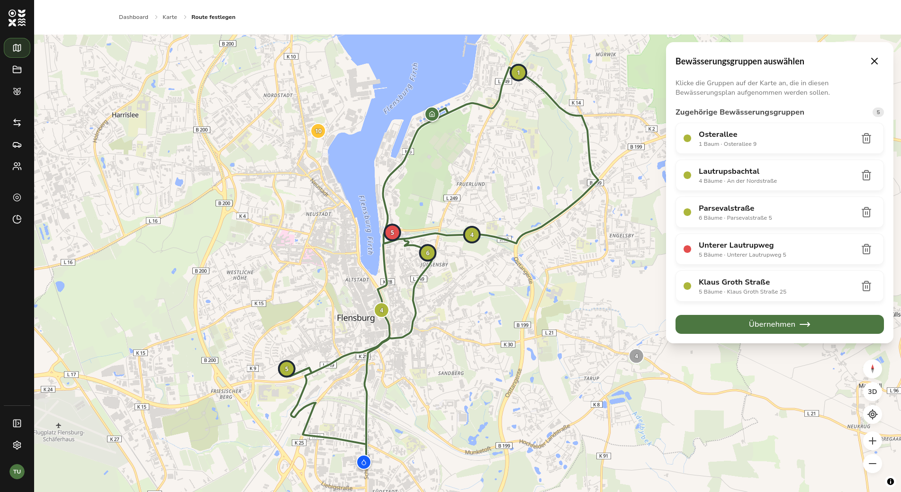
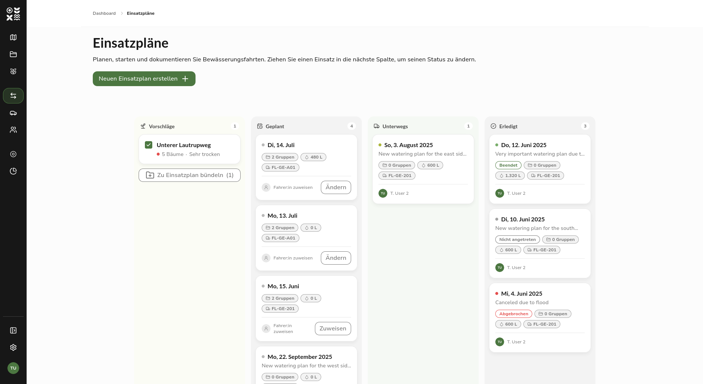
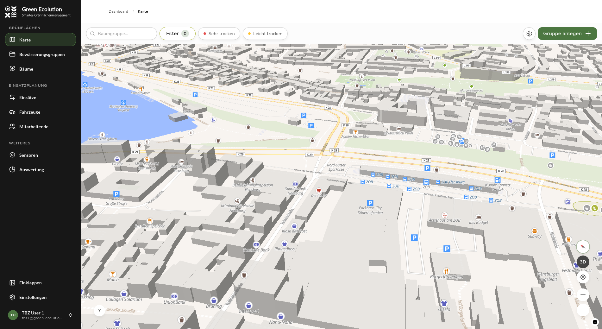

Nachdem sich [0.3.0](/releases/v0.3.0) auf die neue Karte und die Bewässerungsgruppen konzentriert hat, schließt Version 0.4.0 eine Lücke aus der Architektur-Umstellung in [0.2.0](/releases/v0.2.0): Die automatische Routenberechnung für Bewässerungsfahrten ist wieder verfügbar. Sie läuft jetzt über den neuen Routing-Dienst [Streamlet](https://github.com/green-ecolution/streamlet) und berücksichtigt dabei Nachfüllpunkte auf der Route. Daneben wurde die Einsatzplanung von einer Listenansicht zu einem Kanban-Board umgebaut.

## Highlight des Releases

### Routenoptimierung mit Streamlet

Beim Anlegen eines Bewässerungsplans berechnet Streamlet die Fahrtroute über die ausgewählten Bewässerungsgruppen und legt dabei die Reihenfolge der Stopps fest. Neu ist der Umgang mit dem Wasservorrat: Reicht die Kapazität des Fahrzeugs nicht für alle Gruppen des Plans, plant Streamlet Zwischenstopps an Nachfüllpunkten ein, an denen Wasser nachgetankt werden kann.

Das Ergebnis ist im Plan direkt sichtbar. Die Detailseite zeigt die Route als Linie auf der Karte, dazu Distanz, Fahrtdauer, den Wasserbedarf und die Zahl der Nachfüllstopps. Der Startpunkt und die angefahrenen Nachfüllpunkte erscheinen als eigene Markierungen auf der Karte. Für Navigationsgeräte lässt sich die Route als GPX-Datei herunterladen.

Auch die Startpunkte selbst wurden überarbeitet. Sie waren bisher fest in der Konfiguration hinterlegt und werden jetzt als eigene Datensätze in der Datenbank gepflegt. Im Planformular ist der Startpunkt ein Pflichtfeld; der als Standard hinterlegte Punkt ist bereits vorausgewählt.

### Einsatzplanung als Kanban-Board

Die Übersicht der Bewässerungspläne war bisher eine Liste. Sie ist jetzt ein Kanban-Board mit den Spalten Vorschläge, Geplant, Unterwegs und Erledigt. Ein Plan wandert per Drag-and-drop von Spalte zu Spalte und wechselt dabei seinen Status. Braucht ein Wechsel zusätzliche Angaben, etwa beim Abbrechen oder Abschließen eines Plans, fragt ein Dialog diese ab.

Die Spalte Vorschläge zeigt Bewässerungsgruppen, die bewässert werden sollten. Mehrere Gruppen lassen sich dort auswählen und direkt zu einem neuen Bewässerungsplan bündeln, der die Auswahl bereits enthält. Außerdem lassen sich einem Plan direkt im Board Mitarbeiterinnen und Mitarbeiter zuweisen; die Zuordnung wird gespeichert und am Plan angezeigt.

## Neue Kartenfunktionen

Die interaktive Karte hat eine erweiterte Steuerung bekommen. Ein Kompass richtet die gedrehte Karte wieder nach Norden aus, eine 3D-Ansicht neigt die Kamera für einen räumlichen Blick auf das Stadtgebiet, und eine GPS-Ortung zeigt die eigene Position samt Genauigkeitsradius an. Die Karte folgt der Position so lange, bis sie von Hand verschoben wird. Eine einklappbare Legende erklärt zudem die Farben des Bewässerungsstatus.

Das Detailpanel einer Bewässerungsgruppe zeigt anstelle des reinen Bodenfeuchte-Werts den Bewässerungsstatus mit einer kurzen Einordnung. Das Bearbeiten einer Gruppe führt vom Panel nun in denselben Bearbeitungsmodus wie überall sonst, inklusive Baumauswahl auf der Karte. Das Löschen einer Gruppe ist in das Dashboard gewandert und muss dort vor dem Ausführen bestätigt werden.

## Weitere Verbesserungen

Die Seitenleiste lässt sich jetzt zu einer Icon-Leiste einklappen, der gewählte Zustand bleibt über Sitzungen hinweg gespeichert. Am unteren Ende der Leiste ersetzt ein Benutzermenü mit Name und E-Mail-Adresse den bisherigen Abmelden-Eintrag. Über das Menü sind Profil und Abmeldung erreichbar.

Bei den Sensoren zeigt die Karte „Letztes Signal" nun das Sende-Intervall des Geräts, etwa „sendet alle 20 Min.". Damit lässt sich einschätzen, wann die nächste Übermittlung zu erwarten ist und ob eine ausbleibende Meldung ein Problem bedeutet. Der Verlauf der Empfangsstärke bietet eine Zeitraumauswahl, und die Messwerte eines Sensors werden paginiert und nach Zeitraum gefiltert abgerufen, was die Detailseite bei langen Messreihen entlastet.

Mit diesem Release wurde außerdem das alte Go-Backend endgültig aus dem Repository entfernt. Die Plattform läuft damit vollständig auf dem neuen Backend, dessen Umbau in [0.2.0](/releases/v0.2.0) begonnen hatte. Für den Betrieb sind die Liveness- und Readiness-Probes jetzt unter dem API-Pfad erreichbar.

## Behobene Fehler

Der Empfang von Sensordaten blieb nach einem Neustart des MQTT-Brokers stumm, weil die Verbindung sich nicht neu anmeldete; das ist behoben, und der Server beendet sich bei einem Neustart jetzt geordnet, ohne laufende Anfragen abzubrechen. Bei Bewässerungsplänen konnten Zugfahrzeug und Anhänger vertauscht angezeigt werden, weil die Rollen nicht ausdrücklich gespeichert waren. Wird ein Baum in eine andere Gruppe verschoben, aktualisiert die bisherige Gruppe nun ebenfalls ihren Status und ihre Position auf der Karte.

Außerdem bringt ein einzelner inkonsistenter Plan die Plan-Liste nicht mehr zum Erliegen, und die beim Abschluss eines Plans erfasste Wassermenge bleibt beim späteren Bearbeiten erhalten.

## Ausblick

Das Kanban-Board ist der erste Schritt eines größeren Umbaus der Einsatzplanung und wird in den kommenden Versionen weiter ausgebaut. Auch die Routenplanung mit Streamlet wird auf Basis der Erfahrungen aus dem Praxiseinsatz weiterentwickelt.

Rückmeldungen und Fehlerberichte sind jederzeit willkommen auf [GitHub](https://github.com/green-ecolution/green-ecolution/issues).
