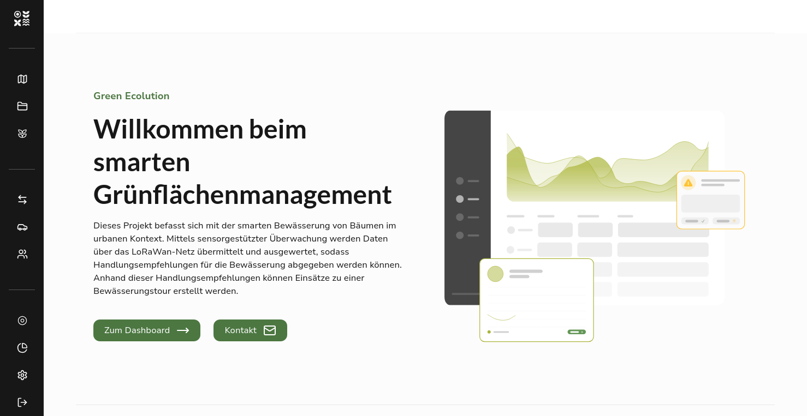

After a year of intensive research and development at Hochschule Flensburg, we are pleased to present the first public version of Green Ecolution. This version marks the conclusion of the research project and, at the same time, lays the foundation for further development as an independent open-source project.

## What is Green Ecolution?

Green Ecolution is a platform for smart green space management, developed specifically for the challenges of urban tree care. The focus is on demand-based irrigation of young trees, which are particularly vulnerable to drought stress during their first years at their site.

The software combines IoT sensor data with intelligent route planning to support irrigation teams in their daily work while saving water and resources.

## Core Features

### Tree Registry & Vegetation

Capture and manage your entire tree population digitally. Every tree is documented with relevant information such as location, species, planting year, and current condition. Trees can be combined into logical groups (clusters) to ease operations planning.

### IoT Sensor Integration

Green Ecolution supports the integration of soil moisture sensors via the LoRaWAN network. The sensors measure at different depths and continuously provide soil moisture data. These measurements feed directly into irrigation planning.

### Intelligent Route Planning

Based on the sensor data and the current irrigation need, the system calculates optimized routes for the irrigation vehicles. Route optimization takes into account factors such as tank capacity, vehicle type, and staff availability.

### Vehicle Management

Manage your irrigation vehicles with all relevant information such as tank capacity, vehicle type, and availability. The vehicle data feeds directly into route planning.

### Irrigation Schedules

Create and track irrigation runs. The system logs completed irrigations and ensures that no tree is forgotten.

## Technical Foundations

Green Ecolution is designed as a modern web application:

- **Backend**: Go with a PostgreSQL database
- **Frontend**: React with TypeScript
- **Routing**: Integration of Valhalla and Vroom for route optimization
- **IoT**: MQTT-based sensor connectivity
- **Auth**: OIDC/Keycloak for user management
- **Deployment**: Docker and Kubernetes

The entire codebase is open source and available on [GitHub](https://github.com/green-ecolution/green-ecolution).

## Demo

Want to try Green Ecolution yourself? Our [demo instance](https://demo.green-ecolution.de) lets you explore the platform with sample data and get to know its features.

## Known Limitations

As the result of a research project, this version is a functional prototype but not yet optimized for production use. The following points are known to us:

- **Forms**: Some input forms in the frontend are not yet fully optimized
- **Route calculation**: Problems can occur in certain scenarios during route planning
- **General stability**: The software is under active development

We are continuously working to improve these points. Feedback and bug reports are always welcome.

## Outlook

With the conclusion of the research project, a new phase begins: further development as a community-driven open-source project. Planned extensions include improved analytics, mobile apps for field staff, and extended interfaces to existing municipal systems.

We invite everyone interested to explore, test, and help shape the project on GitHub.
