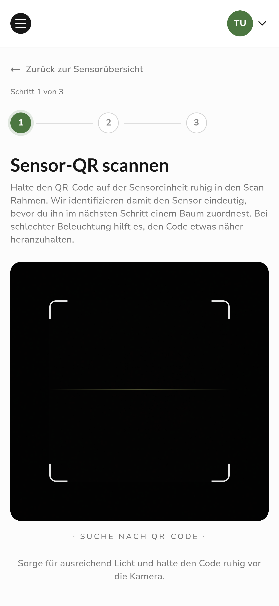
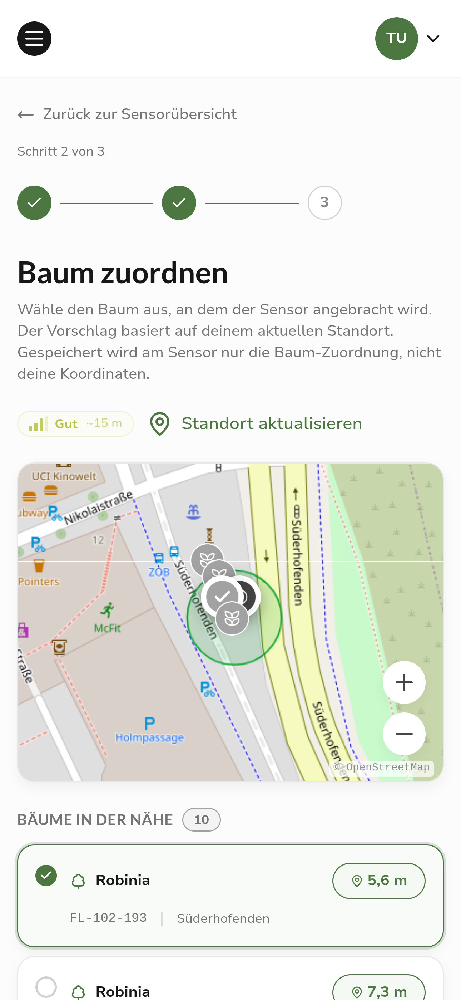
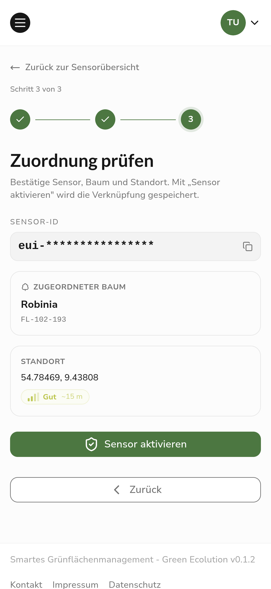

After the stabilization releases [0.1.1](/releases/v0.1.1) and [0.1.2](/releases/v0.1.2), this version centers on one of the most important features for practical use: activating and assigning soil moisture sensors directly on site. At the same time, we fundamentally reworked the architecture of the platform in the background, laying the foundation for faster and more reliable further development.

## Release Highlight

### Activating sensors via QR code

Setting up a new sensor has become significantly easier with version 0.2.0. Instead of entering device data by hand, a sensor can now be put into operation directly in the field through a guided wizard.

The process begins by scanning the QR code on the sensor. The app automatically reads out the unique sensor identifier, so long device IDs no longer need to be typed in. If needed, the recognized identifier can be copied with one click.

Then the application captures the current location via the GPS of the device and suggests the nearest trees for selection. In most cases, it is enough to confirm the suggested tree. If the desired tree is not among them, it can still be selected manually. Before saving, the wizard matches the sensor against the database, so that no duplicate or invalid assignments occur.

As soon as a sensor is assigned to a tree, its measurements automatically feed into the irrigation status of that tree. This creates an up-to-date picture of the water demand on site without additional effort.

## Further Improvements

From this version on, Green Ecolution can be installed as a Progressive Web App (PWA) and then behaves like a standalone app on smartphone or tablet. This is especially helpful for field work, where network coverage is not reliable everywhere. A dedicated splash screen on startup and improved behavior when the connection is missing make for a smoother experience on the go.

The detail view of a sensor was redesigned and structured more clearly, so status, location, and measurements can be grasped more quickly. The info page was also reworked and now shows real data instead of placeholders. At a glance, it is visible which services are available and whether a new version is ready, which noticeably eases operations and troubleshooting.

In the frontend, the React Compiler is now also active, automatically optimizing the application in many places. As a result, the interface responds more smoothly, especially on devices with limited performance.

## Revised Architecture

In the background, we rebuilt the entire server architecture of the platform. For everyday use, this changes little at first, but the foundation for further development is now significantly more stable and easier to maintain. Clearly separated domains and consistent logging of processes help implement new features faster and with fewer bugs.

## Known Limitations

While the new architecture is being stabilized, two features are temporarily disabled in this release. Automatic route calculation for irrigation runs, as well as the plugin system, will be reactivated in one of the upcoming versions once they have been fully migrated to the new foundation. Irrigation schedules can still be created and managed, and the tree registry as well as the sensor features remain available unchanged.

## Outlook

In the next versions, we will bring route planning and the plugin system back on the new architecture and continue to expand the sensor features.

Feedback and bug reports are always welcome on [GitHub](https://github.com/green-ecolution/green-ecolution/issues).
