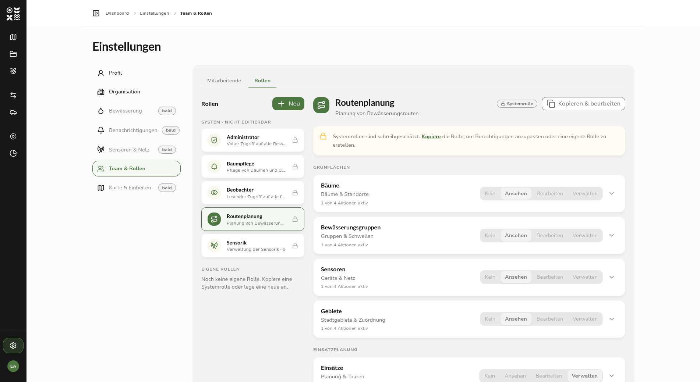
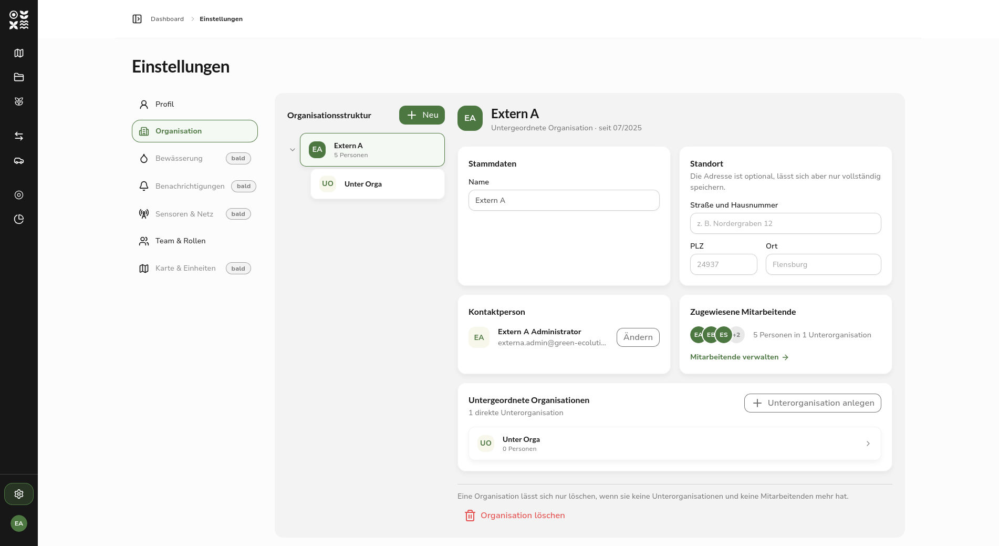
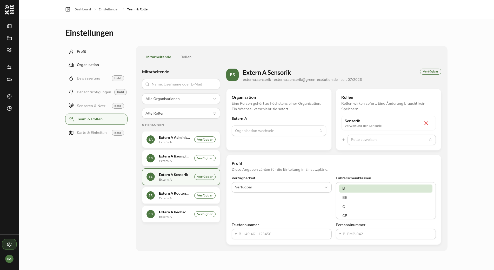
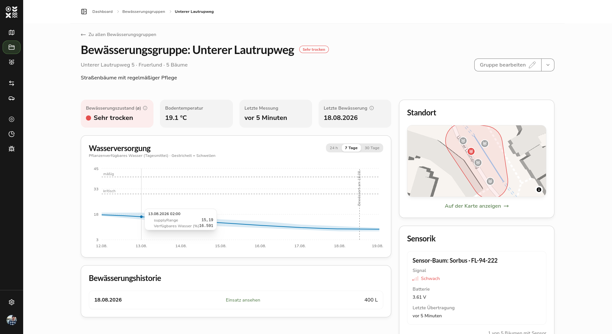
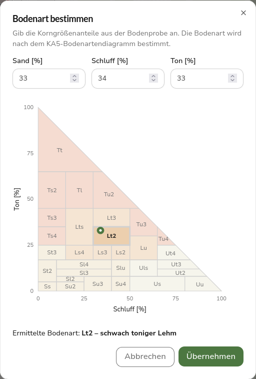

After [0.4.0](/releases/v0.4.0) put route planning and operations planning at the center, version 0.5.0 answers a different question: who is allowed to do what on the platform. Until now, this was governed by a fixed list of roles stored in the identity provider, which could only be changed there. It is replaced by a permission system that the application manages itself. Roles are created in the settings, their permissions are set per area, and they are assigned to individual people. On top of that comes an organization structure that lets trees, sensors, vehicles, and irrigation schedules be assigned to individual units and contracted external companies.

## Release Highlight

### Roles with freely assignable permissions

A role is a named collection of permissions. The permissions themselves are grouped into areas, which fall into three categories. Under Green Spaces are trees, irrigation groups, sensors, and areas; under Operations Planning are irrigation schedules and vehicles; under Administration are staff, the organization, and the roles themselves. For each area, one of the levels None, View, Edit, or Manage can be chosen. Anyone who wants finer control sets the four actions View, Create, Edit, and Delete individually; the role then counts as custom.

Five system roles ship by default: Administrator, Tree Care, Sensors, Route Planning, and Observer. They serve as templates, cannot be changed themselves, and cannot be assigned directly. Anyone who wants to use them as a starting point makes a copy: the copy belongs to their own organization and is freely customizable. These copies are created automatically when a new organization is set up. A role can never grant more permissions than the person editing it holds themselves. Permissions missing for that reason cannot be selected in the editor.

In the interface, permissions affect both navigation and the actions available within a page. Navigation shows only entries that are actually reachable, and directly visiting a locked address leads to a notice page instead of an error. Within pages, the buttons for create, edit, delete, and archive disappear when the permission is missing, rather than staying visible but disabled. Moving cards on the operations board is likewise tied to the edit permission.

### Organizations with location and contact person

Organizations are structured hierarchically. Below the top-level organization of an installation come the tenants, and below those their own units and contracted external companies. The Settings › Organization page shows this structure as an expandable and collapsible tree with member counts, alongside the details of the selected organization.

In addition to a name, every organization has a location and a contact person. The location is optional but can only be saved as a complete entry: if street, postal code, or city is missing, saving is blocked and the missing fields are marked. Only members of the same organization can be chosen as contact person. Sub-organizations can be created, renamed, and deleted as long as no sub-organizations or people are still attached to them. The top-level organization remains read-only. Each tenant sees only its own subtree.

### Managing staff

The staff overview used to be a plain read-only list with no actions. It is now a management interface following the same pattern as the roles and organization pages: the person list with a search field, filters for organization and role, and a total counter on the left, and the detail area on the right, which slides over the list on narrow screens. The search covers first name, last name, username, and email address and runs on the server, so it finds a person regardless of which page of the list they are on.

At the top of the detail area are the username, email address, affiliation, and availability status. These fields are read-only because the identity provider owns them; if the email address has not yet been confirmed, a notice appears there.

Below that are three cards for organization, roles, and profile. Changes to organization and roles take effect immediately, a change of organization requires confirmation beforehand, and only roles from the own organization can be assigned. The profile card, with availability status, driving license classes, phone number, and personnel number, has its own save action and warns before unsaved input is discarded. On the own account, roles and organization cannot be changed, so that no one accidentally removes their last role and locks themselves out.

## New: Resources Belong to an Organization

Trees, irrigation groups, sensors, vehicles, starting points, and irrigation schedules are now each assigned to an organization. What a person can see and edit follows from their own organization and the units below it. A permission always applies downward only, never upward.

If an external company is to take care of part of the area, the affected assets are transferred to that organization. For an irrigation group, its trees move along with it. The parent organization keeps access through its roles and can revoke the transfer unilaterally at any time.

## New Irrigation Group Dashboard

The irrigation group detail page used to be a basic data view and is now a dashboard. At the top are four metrics: the average irrigation state, soil temperature, the time of the last measurement, and the last irrigation. Below that follow the water supply history and the irrigation history, with tiles for location, sensors, the trees in the group, and basic data alongside them. The location tile shows a small map with the boundary of the group.

The history no longer shows the raw soil moisture values, but the share of plant-available water in percent, selectable for the last 24 hours, 7 days, or 30 days. For this, the measurements are related to the stored soil type. Dashed lines mark the thresholds for moderate and critical supply, and further markers show when the group was irrigated. If the soil type is missing, a notice points this out, because the calculation is then not possible. On the detail page of a sensor, the history of measured soil moisture per measurement depth remains available.

A prerequisite for this calculation is the soil type of the group, which can now be determined in the form through a new dialog. From the grain size shares of sand, silt, and clay of a soil sample, it determines the soil type according to the KA5 soil texture diagram and shows the sample as a point in the diagram.

## Further Improvements

Settings are now their own area with subnavigation. Besides Organization and Team & Roles, it also contains the own profile, which used to be located elsewhere. The toggle for collapsing the sidebar has moved into the header.

If a profile picture is set, it appears in the sidebar, in the mobile header, and on the profile page; otherwise, the initials remain. The picture, along with phone number, personnel number, driving license classes, and availability, is no longer stored as an attribute in the identity provider, but in the database of the application.

In the API documentation, it is now possible to sign in directly via Keycloak. After that, all requests from the documentation automatically carry the access token, so protected endpoints can be tried out without manually copying it.

## Fixed Bugs

Dialogs, menus, selection lists, and notices appeared and disappeared without transition, because the animations intended for this were not actually configured in the project. They are active again, buttons give visible feedback when pressed, and centered dialogs now fade in instead of flying in from the upper left corner. Anyone with reduced motion or reduced transparency set in their operating system now gets crossfades without movement and dialogs without blur.

An occasional error occurred at sign-in, because the single-use authorization code was, under certain circumstances, redeemed twice. The exchange now happens at most once per sign-in. On mobile devices, the sidebar footer with settings and the user menu disappeared behind the browser bar; it is now fixed in place and stays visible while the sections above it scroll.

## Important for Existing Installations

With this change, roles and organization membership move into the database. The migration creates the top-level organization, ships the five system roles as templates, and immediately provides the top-level organization with a ready-to-use copy of each role. People without an organization are assigned to the top-level organization.

Roles that were previously maintained in the identity provider are no longer read by the application from the token. After the update, no role is therefore assigned yet; the assignment happens once under Settings › Team & Roles. Anyone running the platform without sign-in as a demo is not affected by this; access there continues to be treated as unrestricted.

## Outlook

The settings area is not yet complete. The items Irrigation, Notifications, Sensors & Network, as well as Map & Units, have been created but not yet filled with content. Creating new people is also still missing, because staff of contracted external companies do not yet have user accounts at the time they are added. Both will follow in upcoming versions.

Feedback and bug reports are always welcome on [GitHub](https://github.com/green-ecolution/green-ecolution/issues).
