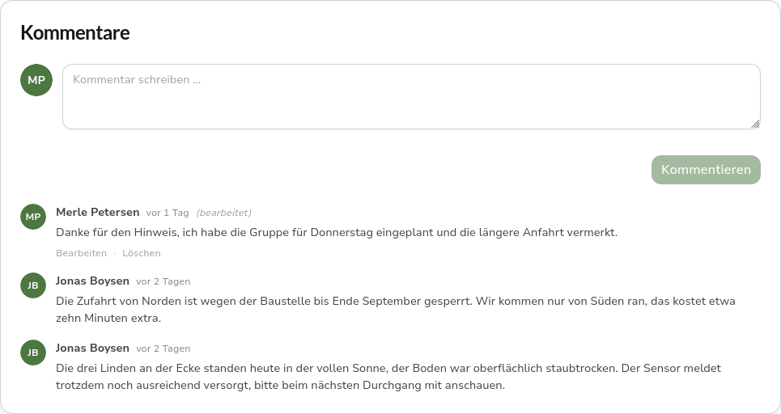
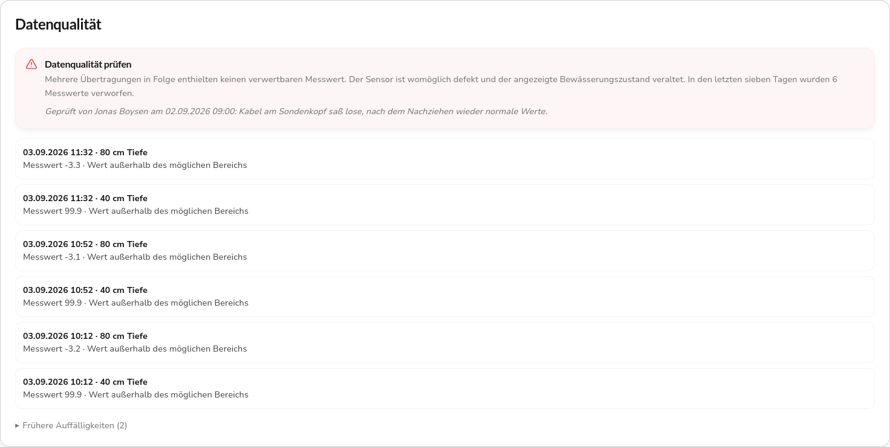
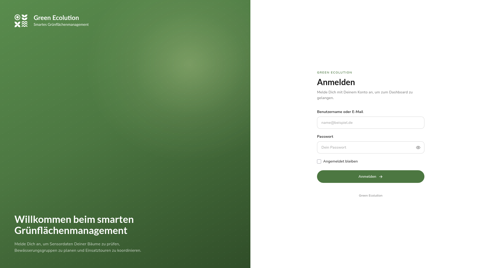
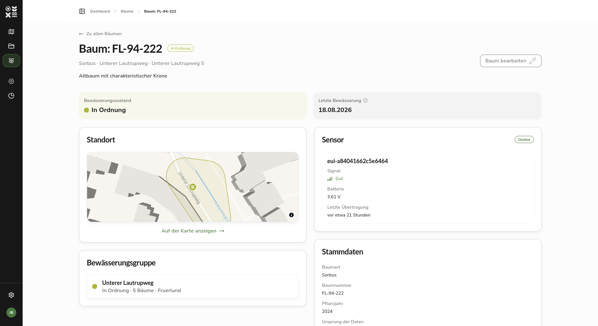

Until now the application could record what was measured and what was driven, but not what someone observed while doing it. Version 0.6.0 adds comments to irrigation groups and schedules. Alongside it stands a change that carries the application beyond its current circle of users: the interface can be switched to English. And incoming sensor data is checked for plausibility before it is evaluated.

## Release Highlight

### Comments on irrigation groups and schedules

Observations from the field had no place in the application. Whether a group could not be reached because of roadworks, or why an operation went differently than planned, ended up in a note outside the system at best.

The detail page of an irrigation group and that of an irrigation schedule now carry a comment section. Anyone allowed to see the group or the schedule may write there. Editing and deleting stay with the person who wrote the comment, and an edited comment is marked as such. Longer threads are loaded on demand rather than filling the page with hundreds of entries. When a group or a schedule is deleted, its comments go with it.

## New Features

### English as a second language

The interface was available in German only. All of its text now lives in catalogs and is translated into German and English. The language is switched in the profile settings. The choice applies to that browser and takes effect immediately, without a reload. Date and number formats follow the language.

This is not limited to the text written into the interface. Messages about rejected input partly arrived from the API as finished English sentences. Instead, the API now returns a stable code for every cause and a key for every field it objects to. The message itself is composed by the interface in the selected language. That also lays the groundwork for adding further languages without touching the API.

### Plausibility checks for sensor data

A reading outside the physically possible range, or an implausible jump from the previous value, could distort the irrigation status of an entire group. Incoming readings are therefore checked on arrival. Conspicuous values are stored and flagged, but excluded from evaluation, so irrigation status and charts rest on the remaining values. The flag sits on the individual reading rather than on the whole transmission, because typically a single probe fails while battery and temperature values remain correct.

In the sensor overview and on the sensor cards of the tree and group pages, a sensor now carries one of three states: “Data plausible”, “Some values discarded” or “Check data quality”. The third stands for several transmissions in a row without a usable reading, and therefore for a suspected defect. The detail page names the affected readings with depth and reason, and discarded values are marked in the history chart.

Anyone who knows the cause, a probe not yet connected during preparation for instance, can acknowledge the current state with a note. That is not a done marker but a watermark: should implausible values occur again afterwards, the sensor reports on its own. Sensors not yet put into service report nothing at all, because an unconnected probe is the normal case there.

### A login page in the visual language of the application

The login ran on Keycloak's standard interface and looked accordingly like a system from elsewhere. It is now implemented as a theme of its own and uses the colors, typefaces and form elements of the application. The layout is split, with the login form on one side and a brand panel on the other.

## Security

The API was tightened in several places. The endpoints carrying deployment information disclosed hostname, uptime, the reachability of database, identity provider and broker, and the number of stored records, all without a login. They now sit behind authentication. The version rendered in the footer before any login exists and the map configuration, without which the map cannot be drawn, stay public.

Roles could also be read across organizations: any authenticated account could query the names and permission sets of other organizations' roles. Both endpoints now evaluate the read permission in the organization being addressed.

Two further points concern operations. A configuration without authentication was one mistyped value away in staging and production, and would have turned every request into an unrestricted anonymous one. The boot now stops in that case, as it does when an internet-facing environment allows arbitrary origins for cross-origin requests. The public demo instance, which deliberately runs without a login, is an environment of its own with its own configuration for that reason. A failure while processing a request also no longer ends in a dropped connection but in a regular error response; a request left unanswered after 60 seconds is terminated.

## Further Improvements

### Tree detail page

The detail page of a tree held a tab of its own with sensor data and raw charts. Both already exist on the sensor and group pages, there with prepared histories, so the tree page showed either the same curve a second time or an empty card. It is now a record: a header with the irrigation status, two key figures, and four cards for location, group, sensor and master data. Histories live on the sensor and group pages only.

## Fixed Bugs

### Irrigation status without a calibration

When the soil type of a group was set to unknown, its trees stayed on the status calculated last. Without a matching calibration the value cannot be determined anew, and the application skipped the calculation instead of discarding the status. The outdated value kept being presented as current. If the calibration is missing, the status now reads unknown. The same applies to trees past the monitored growth period. Malformed transmissions are still skipped, so that a single broken uplink does not discard a valid value.

### Login

On the start page, moving the mouse pointer over a link was enough to trigger the login. The router prepares the target route as soon as a link is hovered, and the guard started the redirect while doing so. It now begins on a click.

Anyone returning to the application without having completed the login was left with a blank page that only a reload cleared. This affected the installed app, which opens the login in a tab of its own, and the return via the browser's back button. Both cases now lead to the start page with its login button. A loading step that hangs for longer also shows a spinner instead of an empty area.

### Forms and operations planning

Merely opening a form was enough for the browser to warn about unsaved changes on reload or close, even without any input. The warning now appears only after an actual edit. Two further triggers disappeared as well: the preselected start point in the schedule form and an unchanged tree selection had marked the form as edited.

In the status dialog of an irrigation schedule, all six states were offered, including those the application would subsequently reject. The error only showed after submitting. Only the transitions possible from the current state are offered now, and for a terminal state an explanatory note appears instead of a form that cannot succeed. For “Not carried out” the reason field was missing as well, without which the change could not be saved at all.

### Organizations and roles

Anyone editing or deleting a role they hold themselves could strip their own role and user administration permissions and lock their account out. The path through one's own role assignment was already blocked, the one through the role definition was not. Both changes are now simulated beforehand and rejected if the administration permissions would no longer hold afterwards. Editing a role one holds remains possible as long as those permissions survive.

When a person moved to another organization, they stayed registered as contact person of the old one although they no longer belonged to it. The reference is now released before the move.

The organization and role pages opened in the narrow layout meant for small screens on a direct visit or after a reload, even in a wide window. The reason was a width measurement taken while the page was still loading. It is now taken as soon as the layout is actually there.

In the public demo instance, the login-free access belonged to no organization. Forms therefore preselected the wrong one, nearly all trees on the map were dimmed and could not be selected, and the pages for roles and organizations stayed empty. The access is now assigned to an organization.

## Outlook

The comments are a first step. In the long run, photos and documents should be attachable to an irrigation group as well; that is recorded as an idea but not yet scheduled.

Sharing individual resources with sub-organizations, mentioned in the outlook of [0.5.1](/releases/v0.5.1), is still pending. It remains the next larger step for the permission model, so that a contracted company can look after a stock of trees without it being transferred to them.

Feedback and bug reports are always welcome on [GitHub](https://github.com/green-ecolution/green-ecolution/issues).
